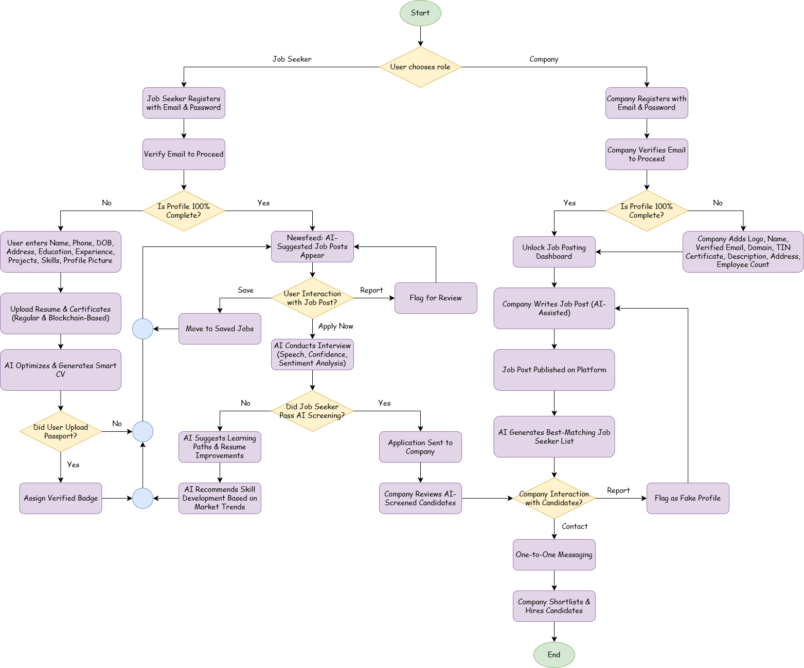

<h1 align="center">Team Prefetch</h1>

<table>
  <tr align="center">
    <th>Md. Waliul Islam Rayhan</th>
    <th>Md. Nahid Hasan</th>
    <th>Asir Shahriar Roudra</th>
    <th>Nishat Mahmud</th>
  </tr>
  <tr align="center">
    <td>Team Leader</td>
    <td>Team Member</td>
    <td>Team Member</td>
    <td>Team Member</td>
  </tr>
  <tr align="center">
    <td>Frontend Developer</td>
    <td>Backend Developer</td>
    <td>AI/ML Engineer</td>
    <td>UI/UX Designer</td>
  </tr>
  <tr align="center">
    <td><a href="https://github.com/waliulrayhan">@waliulrayhan</a></td>
    <td><a href="https://github.com/nahid515023">@nahid515023</a></td>
    <td><a href="https://github.com/roudra323">@roudra323</a></td>
    <td><a href="https://github.com/nishatrhythm">@nishatrhythm</a></td>
  </tr>
</table>

---

<b>ABSTRACT OF THE PROJECT</b>

<h2 align="center">CareerLink – Connecting Talent, Empowering Futures</h2>

An AI-Powered Job Recruitment & Professional Networking Platform

 

### Problem Statement

Traditional recruitment processes are riddled with inefficiencies, biases, and one-size-fits-all approaches that fail both job seekers and companies. Job seekers often struggle to get noticed due to generic profiles and receive irrelevant job recommendations, while companies face an overwhelming volume of applications and difficulty in filtering the best-fit candidates. This platform seeks to address these issues by introducing a dual-sided system where both job seekers and companies undergo rigorous profile validation, allowing for AI-driven smart matching, personalized career development, and secure verification methods.

### Proposed Solution

Our platform emulates a LinkedIn-style ecosystem with two distinct user types:

**1. Job Seekers**

- **Registration & Profile Completion:**
    
Users register using an email and password. They are required to complete their profile before accessing any content. The profile collects detailed personal information, including Name, Phone, Date of Birth, Address, Educational Qualifications, Previous Experience, Projects, Skills, Profile Picture, and more.

- **Document Uploads & Smart CV Generation:**
    
Job seekers can upload certifications and resumes. The platform then leverages AI/ML to generate a smart, optimized CV tailored to industry standards.

- **Blockchain & Verification Features:**
    
Users with blockchain-secured certificates can add these to their profiles. Additionally, passport verification earns them a verified badge for enhanced trust.

**2. Companies**

- **Registration & Profile Completion:**
    
Companies must complete a detailed registration that includes uploading the company logo, providing the Company Name, a verified email, domain (if available), TIN Certificate, Company Description, Address, Employee Count, and related details before posting any jobs.

- **Job Post Creation with AI Assistance:**
    
While creating a job post, companies benefit from an AI assistant that guides them in drafting effective job descriptions.

- **Candidate Matching & Interaction:**
    
Once a job post is published, companies receive a curated list of job seekers who best match the required skills, experience, education, and project background. For each candidate, two actions are provided:

    - **Contact:** Enables one-to-one communication and further coordination for a screening test.
    - **Report:** Flags the candidate if they appear to be a fake or fraudulent profile.

### System Workflow & UI/UX

**1. User Onboarding (Job Seeker Perspective):**

- **Step 1: Registration & Profile Completion**
    
Job seekers sign up with email and password and must fill out all mandatory fields (personal information, educational background, work experience, projects, skills, profile picture, etc.) before unlocking the platform’s full features.

- **Step 2: Document & Certificate Upload**
    
Users upload various certifications and resumes. Verified blockchain certificates and passport verification lead to enhanced credibility via badges.

- **Step 3: Newsfeed & Job Post Interaction**
    
Upon profile completion, the job seeker’s homepage displays a dynamic newsfeed populated with job posts from companies. Each post includes three interactive buttons:

    - **Apply Now:** Opens a dedicated job post page where the candidate must complete a brief, AI-driven screen test via video (a mock interview assessing speech, tone, and confidence).
    - **Save:** Allows the candidate to bookmark the post for future reference.
    - **Report Post:** Enables the user to flag any suspicious or fake job postings.

Figure 1 : System Flowchart

**2. Company Onboarding & Interaction (Company Perspective):**

- **Step 1: Registration & Profile Completion**
    
Companies register and complete their profiles by providing detailed company information (logo, name, verified email, domain, TIN Certificate, description, address, employee count, etc.).

- **Step 2: Job Post Creation with AI Assistance**
    
After profile completion, companies can create job posts. An integrated AI assistant helps draft the job description by suggesting improvements and industry-relevant keywords.

- **Step 3: Viewing the Dashboard & Candidate Matching**
    
In the company’s dashboard, job posts are listed with an associated candidate list. This list is generated by an AI/ML system that matches job seeker profiles (using tags for skills, experience, education, and projects) to the job requirements. For each candidate, the company can:

    - **Contact:** Initiate one-to-one communication. The platform also provides a refined list of candidates qualified for an AI-driven video screening test.
    - **Report:** Flag any candidate suspected of fraudulent behavior.

**3. Personalized AI Enhancements for Both Users:**

- **Job Recommendations:**
    
The platform continuously curates the job seeker’s newsfeed based on their skills, experience, and projects.

- **Career Growth Suggestions:**
    
If a job seeker has experience in a particular domain (e.g., Node.js), our AI/ML model recommends complementary skills such as DevOps or CI/CD to improve their job prospects and expected salary.

**4. Backend Tagging & Data Categorization:** 
- 
Every job seeker and job post is categorized using predefined tags (skills, experience, education, etc.), ensuring accurate matching and personalized recommendations for both sides.

### Technology Used

- **Frontend:** Built using the Next.js framework for a dynamic and responsive user experience.
- **Backend:** – Powered by Node.js for robust server-side operations.
- **Database:** – PostgreSQL for structured, scalable, and reliable data management.
- **API Architecture:** – Implements RESTful APIs for seamless system communication.
- **Artificial Intelligence & Machine Learning:** For resume parsing, candidate-job matching, and personalized career growth suggestions.
- **Natural Language Processing (NLP):** To generate optimized job posts and analyze video interviews.
- **Blockchain Integration:** For secure, tamper-proof certification uploads.
- **Cloud Infrastructure & Scalable Databases:** To manage high volumes of data and ensure real-time responsiveness.
- **Video Processing & AI Vision Models:** To facilitate the AI-driven mock interview process.

Figure 2 : Backend AI & Security Systems Flowchart

### Impact & Benefits

- **Enhanced Hiring Efficiency:** Streamlined candidate screening and matching reduce recruitment time and costs.
- **Bias-Free, Merit-Based Recruitment:** AI-powered evaluation minimizes subjective biases, ensuring a fairer hiring process.
- **Personalized Career Development:** Continuous skill recommendations empower job seekers to remain competitive in the evolving job market.
- **Improved Engagement:** Dynamic newsfeeds and interactive screening processes create a compelling user experience for both job seekers and companies.
- **Robust Security & Verification:** Blockchain-based certifications and strict profile completion protocols enhance trust and data integrity.

### Innovative Feature: AI Career Coach

In addition to the core functionalities, our platform introduces the <b>AI Career Coach</b>—an intelligent engine that:

- Analyzes industry trends and the user’s profile to recommend further learning (e.g., suggesting DevOps or CI/CD for Node.js professionals).
- Provides personalized learning roadmaps and predicts potential salary growth based on career trajectories.
- Enhances the overall value of the platform by bridging the gap between current skills and future opportunities.

### Emerging AI Technologies & Practical Considerations

To enhance recruitment, our platform integrates <b>Generative AI for smart CV/job descriptions, AI-driven behavioral analysis for video interviews, blockchain for secure certification verification and AI chatbots for 24/7 candidate support.</b>

For <b>candidate engagement & retention</b>, we offer <b>personalized career roadmaps, smart job alerts, gamified skill assessments, and AI-powered networking.</b>

To adapt to <b>remote work & global hiring</b>, we provide <b>AI-driven global talent matching, remote work adaptability filters, multilingual chat support, and virtual coworking integration.</b>

While <b>globally scalable</b>, our <b>initial focus is Bangladesh</b>, addressing <b>skill gaps, unemployment, industry-specific job matching, and fraud prevention.</b>

Ethical concerns include <b>bias in AI models, data privacy, transparency in AI decisions, and fair evaluation metrics.</b>

To scale, we require <b>cloud hosting (AWS/GCP), AI compute resources (NVIDIA GPUs), encrypted databases, and API integrations with job portals.</b>

Security is ensured via <b>end-to-end encryption, blockchain-based verification, MFA, AI-driven fraud detection, and compliance with GDPR, CCPA, and Bangladesh’s data protection laws.</b>

Our platform is <b>future-proof, scalable, and designed to revolutionize AI-driven recruitment globally.</b>

---

<h2 align="center">Project Portfolio</h2>

Below are some of the past projects our team has worked on, demonstrating expertise in <b>AI, web development, deep learning, and mobile application development.</b>

**1. JnU Health Care**
    
A <b>university health management system</b> designed to <b>digitalize student medical records, appointment scheduling, and healthcare services.</b> This platform provides a seamless experience for students to book medical consultations, while administrators can monitor healthcare activities efficiently. 
    <b>GitHub Link:</b> [github.com/roudra323/JnU-Health-Care](https://github.com/roudra323/JnU-Health-Care)

**2. Traffic Signs Classification Using Convolutional Neural Networks**
    
A <b>deep learning-based traffic sign classification model</b> built using <b>Convolutional Neural Networks (CNNs).</b> It provides <b>real-time sign recognition</b> capabilities, which can be integrated into <b>autonomous driving and driver assistance systems.</b> The project includes image preprocessing, model training, real-time classification via webcam, and visualization of training/validation results. 
    <b>GitHub Link:</b> [github.com/waliulrayhan/Traffic-Signs-Classification-Using-Convolution-Neural-Networks](https://github.com/waliulrayhan/Traffic-Signs-Classification-Using-Convolution-Neural-Networks)

**3. Quillium**
    
A <b>university-focused social media platform for Android,</b> enabling students to interact and share academic and personal experiences. It features <b>real-time posting, stories, likes, comments, friend requests, notifications, messaging, and AI-driven content moderation.</b> This app creates a <b>secure and collaborative networking space</b> for university students. 
    <b>GitHub Link:</b> [github.com/teamprefetch/Quillium](https://github.com/teamprefetch/Quillium)

